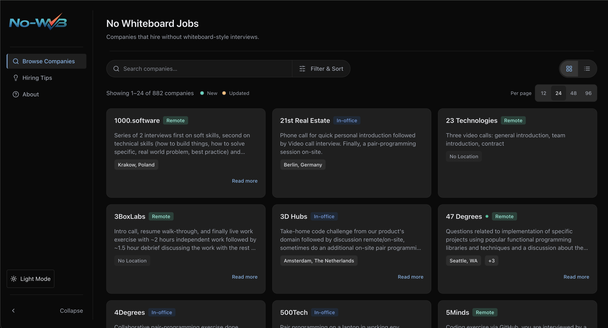

# No Whiteboard Jobs Dashboard


Live site: https://no-wb.org/

## Why this project exists

While job searching, I kept returning to the hiring-without-whiteboards list. It’s an incredible resource, but I wanted a cleaner way to use it day to day.

This project is my attempt to create a cleaner, more accessible dashboard experience on top of that data.

## Who this helps

- Job seekers who want to shortlist companies by interview style
- People who care about interview process transparency
- Developers looking for an Astro example with accessible UI patterns

## Respect and attribution

The underlying company data comes from [poteto/hiring-without-whiteboards](https://github.com/poteto/hiring-without-whiteboards). That repository is the original source of truth and deserves full credit.

This dashboard is an independent personal project built to improve usability and day-to-day browsing. It is not affiliated with or endorsed by the upstream maintainers.

## Preview



## Design and accessibility intent

The interface is kept simple on purpose:

- readable typography and spacing in both light and dark modes
- fully keyboard-accessible search, filtering, and pagination
- semantic markup and clear, visible focus states
- restrained visual design so the company data remains the primary focus

## Implementation approach

- Astro for static rendering, routing, and page composition
- Tailwind + CSS custom properties for consistent theming tokens
- Lightweight client-side TypeScript for browse interactions (search/filter/sort/view state)
- Data merge model that keeps upstream data separate from local overrides (`source`, `overrideReason`, `overrideDate`)

## Run locally

### Prerequisites

- Node.js 22.12+
- npm

### Setup

```bash
npm install
```

### Development

```bash
npm run dev
```

### Quality checks

```bash
npm run lint
npm run test
npm run build
```

## Data model notes

- `src/data/companies.json`: upstream dataset mirror
- `src/data/companies.local.json`: local additions/overrides only
- `src/data/companies.ts`: build-time merge with traceability metadata

Locally curated entries are intentionally labeled in the UI so users can distinguish them from upstream records.

## Upstream sync

`src/data/companies.json` is kept aligned with the production upstream README list automatically. The `Sync upstream companies` GitHub Actions workflow runs weekly (Mondays) and can also be triggered on demand. It rebuilds the static JSON with `companies:sync` (adding new companies, removing delisted ones, and refreshing changed fields like locations or interview process descriptions for existing ones), validates the site, and commits the generated data file when upstream changes are found.

Use these commands to check or run the same sync locally:

```bash
npm run companies:check
npm run companies:sync
```

- `companies:check` exits non-zero when local data differs from upstream.
- `companies:sync` updates `src/data/companies.json` in place.

## Project goals

This project prioritizes:

- fast load times and minimal client JavaScript
- accessibility and keyboard usability
- clear separation between upstream data and local curation
- maintainable structure that can evolve alongside the upstream project

## Current limitations

- Data freshness depends on the weekly upstream sync workflow and the upstream README format remaining parseable
- Interview process descriptions are community-sourced and may be incomplete or outdated
- This project focuses on browsing and reading, not account features or backend moderation

## Contributing

I am not accepting GitHub PRs for this repo right now.

If you want to add or correct a company entry, please open a PR on [poteto/hiring-without-whiteboards](https://github.com/poteto/hiring-without-whiteboards), or submit it through the form on [no-wb.org](https://no-wb.org/).

## License

Licensed under the MIT License. See [LICENSE](./LICENSE).

---

Built by [Afton Gauntlett](https://www.aftongauntlett.com/)
